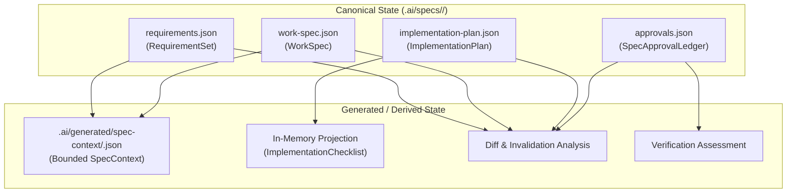
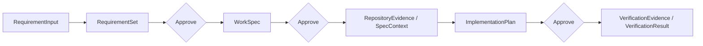

# AI.RepoKit v3 Spec-Driven Development

This document is the authoritative guide to Spec-Driven Development (SDD) in AI.RepoKit v3.0.0.

## Overview

AI.RepoKit v3 introduces a formal, deterministic, evidence-backed specification system. In v3, software specifications are represented as typed, versioned Intermediate Representation (IR) artifacts governed by an explicit approval ledger and validated through concrete repository evidence.

Spec functionality in v3 is strictly specification- and semantics-level: it captures requirements, work specifications, implementation plans, approvals, semantic diffs, and verification results without executing code mutations, task DAGs, or agent runtimes.

---

## Canonical vs. Generated State

AI.RepoKit maintains a strict architectural boundary between canonical state and generated state.



### Canonical State

Canonical state consists of version-controlled, human-approved JSON documents stored under the repository path:

`.ai/specs/<spec-id>/`

The canonical artifacts for a given `<spec-id>` are:

1. **RequirementSet**:
   `.ai/specs/<spec-id>/requirements.json`
   Captures structured requirement inputs (`RequirementInput`), normalized requirements (`Requirement`), constraints (`Constraint`), and acceptance criteria (`AcceptanceCriterion`) with an explicit `ArtifactRevision`.
2. **WorkSpec**:
   `.ai/specs/<spec-id>/work-spec.json`
   Translates accepted requirements into technical work items, architecture decisions, affected component boundaries, and required dependencies. References the target `RequirementSet` revision.
3. **ImplementationPlan**:
   `.ai/specs/<spec-id>/implementation-plan.json`
   Specifies ordered execution steps (`PlanStep`), preconditions, verification anchors, and expected deliverables. References the target `WorkSpec` revision.
4. **Approval Ledger**:
   `.ai/specs/<spec-id>/approvals.json`
   Maintains an append-only ledger of cryptographically bound approvals (`Approval`). Each entry records the approved artifact kind, target revision, entity ID, cryptographic semantic digest, timestamp, and approver identity.

Canonical state is written atomically using temporary staging and directory-level concurrency coordination (`SpecWorkspaceWriteCoordinator`). Mutating canonical state requires explicit human opt-in via `--apply`.

### Generated / Derived State

Generated state consists of transient, derived, or rebuildable projections produced from canonical artifacts and repository analysis:

1. **SpecContext**:
   `.ai/generated/spec-context/<spec-id>.json`
   A bounded context projection combining canonical Spec IR with repository evidence, code indices, and project maps, packaged specifically for LLM and agent ingestion within defined context budgets.
2. **Implementation Checklist**:
   Projected dynamically in memory from the canonical `ImplementationPlan` via `ImplementationChecklistProjector`. **No checklist state is persisted to disk.** Output is rendered on-demand as Markdown or JSON via `airepo spec checklist`.
3. **Diff & Invalidation Reports**:
   Computed dynamically on demand via `airepo spec diff`. Compares candidate IR against canonical IR and projects downstream invalidation impacts.

> [!IMPORTANT]
> Generated state is strictly derived and rebuildable. It is **never** a canonical source of truth. Deleting `.ai/generated/` does not lose specification state, and manual edits to generated files are overwritten during regeneration.

---

## Spec Lifecycle

The Spec lifecycle progresses through formal stages where each transition requires explicit validation and recorded approval:



1. **Input Formulation**: Individual requirement statements and user stories are gathered as `RequirementInput`.
2. **RequirementSet (Revision 1+)**: `RequirementSet` is initialized via `airepo spec init --spec-id <spec-id> --from <req.json> --apply`.
3. **RequirementSet Approval**: An explicit approval is recorded into the approval ledger via `airepo spec approve --spec-id <spec-id> --artifact requirements --revision <n> --apply`.
4. **WorkSpec Elaboration**: Technical specifications are drafted and refined against the approved `RequirementSet` via `airepo spec refine --spec-id <spec-id> --artifact work-spec --from <ws.json> --apply`.
5. **WorkSpec Approval**: The `WorkSpec` revision is approved via `airepo spec approve --spec-id <spec-id> --artifact work-spec --revision <n> --apply`.
6. **SpecContext Assembly**: Repository evidence, code structure, and dependencies are assembled into a bounded `SpecContext`.
7. **ImplementationPlan Definition**: Step-by-step implementation tasks are planned via `airepo spec plan --spec-id <spec-id> --from <plan.json> --apply`.
8. **ImplementationPlan Approval**: The `ImplementationPlan` revision is approved via `airepo spec approve --spec-id <spec-id> --artifact implementation-plan --revision <n> --apply`.
9. **Verification**: After implementation, repository evidence is gathered and evaluated against acceptance criteria via `airepo spec verify`.

---

## Revision & Approval Semantics

Every canonical artifact carries an explicit integer `ArtifactRevision` (starting at 1).

### Approval Statuses

When evaluated by `SpecApprovalStatusEvaluator`, each canonical artifact is assigned one of three statuses:

- `Current`: The artifact revision matches the latest approval entry in the ledger, and its semantic digest matches the digest recorded at approval time.
- `Stale`: The artifact was previously approved at an earlier revision, but the current canonical artifact has advanced to a newer revision, or an upstream artifact on which it depends was modified.
- `NotApproved`: No approval record exists in the ledger for this artifact kind.

### Semantic Invalidation

Approvals are bound not merely to revision numbers, but to the exact semantic content via `SpecSemanticDigest` (a normalized SHA-256 hash that ignores superficial JSON formatting and whitespace):

- If an upstream artifact (e.g. `RequirementSet`) is refined, its semantic digest changes.
- Any downstream artifact referencing that upstream revision (e.g. `WorkSpec` referencing `RequirementSet` revision 1) becomes **semantically stale**.
- Downstream approvals are invalidated when upstream dependencies change, preventing stale specifications from falsely appearing verified or approved.
- `airepo spec diff` performs upfront semantic invalidation analysis before changes are applied, indicating which downstream artifacts and checklist items will be affected.

---

## Evidence Semantics & Verification

Verification in AI.RepoKit v3 is evidence-backed, objective, and deterministic. It evaluates concrete repository facts against declared acceptance criteria.

### Core Concepts

- **RepositoryEvidence**: Structured, verifiable facts extracted from the target repository, including test run results, build diagnostics, code index symbols, file hashes, and git state.
- **SpecContext**: The bounded context package containing relevant repository evidence aligned to a specific Spec.
- **VerificationEvidence**: Evidence submitted to evaluate whether a specific criterion or step has been satisfied.
- **VerificationResult**: The outcome of evaluating verification evidence against the approved canonical graph.

### Evaluation Outcomes

Verification evaluates to one of three strictly defined statuses:

| Status | Definition |
| :--- | :--- |
| `PASS` | Recognized supporting evidence is present and fully satisfies the criteria, with **no** contradictory evidence found. |
| `FAIL` | Recognized contradictory evidence is identified (e.g., test failure, missing required export, build error). |
| `NOT_VERIFIED` | Evidence is missing, incomplete, inconclusive, or unrecognized. |

### Strict Invariants

> [!CAUTION]
> **Missing evidence is NOT a PASS.** If evidence is omitted or inaccessible, the result is `NOT_VERIFIED`, never `PASS`.

> [!CAUTION]
> **Unsupported LLM opinion is NOT verification evidence.** Textual affirmations or conversational assertions by an AI model (e.g., "I verified that the code works") do not constitute repository evidence and cannot produce a `PASS` status.

---

## CLI Reference

All v3 Spec operations are accessible through the `airepo spec` command group.

```text
airepo spec [help]
airepo spec init --spec-id <spec-id> --from <requirements.json> [--repo <path>] [--dry-run | --apply] [--json]
airepo spec show --spec-id <spec-id> [--repo <path>] [--artifact requirements|work-spec|implementation-plan|approvals|all] [--json]
airepo spec refine --spec-id <spec-id> --artifact requirements|work-spec --from <candidate.json> [--expected-revision <n>] [--repo <path>] [--dry-run | --apply] [--json]
airepo spec plan --spec-id <spec-id> --from <candidate.json> [--expected-revision <n>] [--repo <path>] [--dry-run | --apply] [--json]
airepo spec approve --spec-id <spec-id> --artifact requirements|work-spec|implementation-plan --revision <n> [--repo <path>] [--dry-run | --apply] [--json]
airepo spec checklist --spec-id <spec-id> [--repo <path>] [--json]
airepo spec diff --spec-id <spec-id> --artifact requirements|work-spec|implementation-plan --from <candidate.json> [--repo <path>] [--json]
airepo spec verify --spec-id <spec-id> --from <verification-request.json> [--repo <path>] [--json]
```

### Command Descriptions

- `airepo spec init`: Initializes a new `RequirementSet` artifact at revision 1. Dry-run by default; requires `--apply` to persist.
- `airepo spec show`: Displays canonical lifecycle state, revisions, digests, and derived approval statuses. Read-only.
- `airepo spec refine`: Refines an existing `RequirementSet` or creates/refines a `WorkSpec`. Supports optimistic concurrency via `--expected-revision`. Dry-run by default.
- `airepo spec plan`: Creates or refines the canonical `ImplementationPlan`. Supports `--expected-revision`. Dry-run by default.
- `airepo spec approve`: Records an approval for a `RequirementSet`, `WorkSpec`, or `ImplementationPlan` into `.ai/specs/<spec-id>/approvals.json`. Dry-run by default.
- `airepo spec checklist`: Projects the derived implementation checklist from the canonical `ImplementationPlan`. Read-only; nothing is written to disk.
- `airepo spec diff`: Performs semantic comparison of candidate IR against canonical state, reporting exact property diffs and downstream invalidation. Read-only.
- `airepo spec verify`: Evaluates verification requests and repository evidence against approved canonical criteria. Read-only.

### Separation from Legacy `airepo plan`

The top-level command `airepo plan` remains unchanged and fully backwards-compatible:
- `airepo plan`: Plans repository client configurations, agent prompts, profiles, and MCP setup (v1/v2 infrastructure).
- `airepo spec plan`: Manages the canonical `ImplementationPlan` artifact for a specific Spec in v3.

---

## Portable MCP Read-Only Spec Context

The AI.RepoKit Portable MCP server (`airepo mcp serve`) exposes read-only Spec information to AI assistants (e.g. Copilot, Claude, Cursor, Gemini) through the existing `get_context` tool.

### Spec Context Queries

Agents can query Spec information using `get_context`:

1. **Canonical Spec Overview**:
   ```json
   { "kind": "spec", "target": "<spec-id>", "detail": "brief" }
   ```
   Returns artifact presence, revisions, approval statuses, semantic digests, requirement counts, and plan step summaries.
2. **Bounded SpecContext**:
   ```json
   { "kind": "spec-context", "target": "<spec-id>", "detail": "brief" }
   ```
   Returns the assembled SpecContext including repository evidence references, constraints, and project scope.
3. **Verification State**:
   ```json
   { "kind": "verification", "target": "<spec-id>", "detail": "brief" }
   ```
   Returns canonical verification criteria, prerequisites, and approval binding status.

### MCP Safety & Boundary Guarantees

- **Session-Repository-Bound**: The MCP server is pinned to the target repository root. Path traversal outside the repository is strictly rejected.
- **Read-Only**: Spec queries via MCP are strictly read-only. MCP cannot create, mutate, or approve Specs, nor execute verification commands.
- **Bounded**: Payloads are governed by `ContextBudget`, preventing token exhaustion.
- **Fixed Portable MCP Surface**: The MCP surface is fixed at **5 tools, 9 resources, and 17 prompts**. No new MCP tools or resources are introduced for Spec; Spec data is served through standard `get_context` kinds (`spec`, `spec-context`, `verification`).

---

## Migration & Upgrade Contract

AI.RepoKit v3 is designed with a strict additive and opt-in upgrade policy:

### Compatibility Guarantees

1. **Zero Implicit Changes**: Upgrading to or installing the 3.0.0 CLI alone **never** creates `.ai/specs/` or any canonical Spec files.
2. **Existing v2 Repositories Remain Unchanged**: All existing v2 workflows (`audit`, `plan`, `setup`, `update`, `self-check`, `mcp-diagnose`, hooks, context-packs) continue to operate identically without requiring Spec adoption.
3. **No Automatic Configuration Rewriting**: Existing `.ai/` policies, manifests, and profiles are not rewritten on CLI upgrade.
4. **No Implicit v2 → Spec Conversion**: Repositories adopt Spec only when a user explicitly runs `airepo spec init ... --apply`.
5. **Dry-Run by Default**: All mutating `airepo spec` commands default to dry-run previews. Files are modified only when `--apply` is passed.
6. **Schema v1 Immutability**: The published Spec IR Schema v1 (`https://ai.repokit.dev/schemas/spec/v1/spec-ir.schema.json`) is frozen and immutable. All existing schema v1 workspaces remain valid, with no implicit schema upgrade.

### User Migration & Adoption Guide

Adopting Spec in an existing repository is straightforward:

1. **Update / Install the v3 CLI**:
   ```powershell
   dotnet tool update --global AiRepoKit.Cli
   ```
2. **Confirm Version**:
   ```powershell
   airepo --version
   # Output: 3.0.0
   ```
3. **Continue Normal v2 Workflows**:
   Existing operations work without modification:
   ```powershell
   airepo self-check --quick
   airepo update
   ```
4. **Optionally Initialize a Spec**:
   Create a requirements candidate file (`req-init.json`) and initialize a Spec:
   ```powershell
   airepo spec init --spec-id feature-auth --from req-init.json --apply
   ```
5. **Inspect & Approve Lifecycle State**:
   ```powershell
   airepo spec show --spec-id feature-auth
   airepo spec approve --spec-id feature-auth --artifact requirements --revision 1 --apply
   ```
6. **Plan, Diff, & Verify**:
   ```powershell
   airepo spec plan --spec-id feature-auth --from plan-candidate.json --apply
   airepo spec checklist --spec-id feature-auth
   airepo spec diff --spec-id feature-auth --artifact requirements --from req-updated.json
   airepo spec verify --spec-id feature-auth --from verif-request.json
   ```
7. **Consume Read-Only Spec Context in MCP**:
   Connect your AI client to `airepo mcp serve` and query:
   ```text
   get_context kind=spec target=feature-auth detail=brief
   ```

---

## V4+ Architectural Boundary

AI.RepoKit v3 strictly limits its scope to the **semantic specification contract**.

### Explicit Non-Goals for v3

The following capabilities are **explicitly excluded** from v3 and remain deferred to later versions (v4+):

- **Task DAG Execution**: v3 does not build, schedule, or execute dependency graphs of implementation tasks.
- **Agent / Client Materialization**: v3 does not instantiate AI agents, assign subtasks to models, or manage multi-agent communication.
- **Model Runtime & LLM Invocation**: v3 contains no built-in model runner, inference loop, or tokenizer runtime.
- **PromptCompiler**: v3 does not compile dynamic prompt templates into model-specific prompts.
- **Autonomous Repair**: v3 does not automatically fix compilation errors, modify codebases, or retry failed tests.
- **Scheduler & Orchestration**: v3 does not provide cron scheduling, workflow orchestration, or background job workers.
